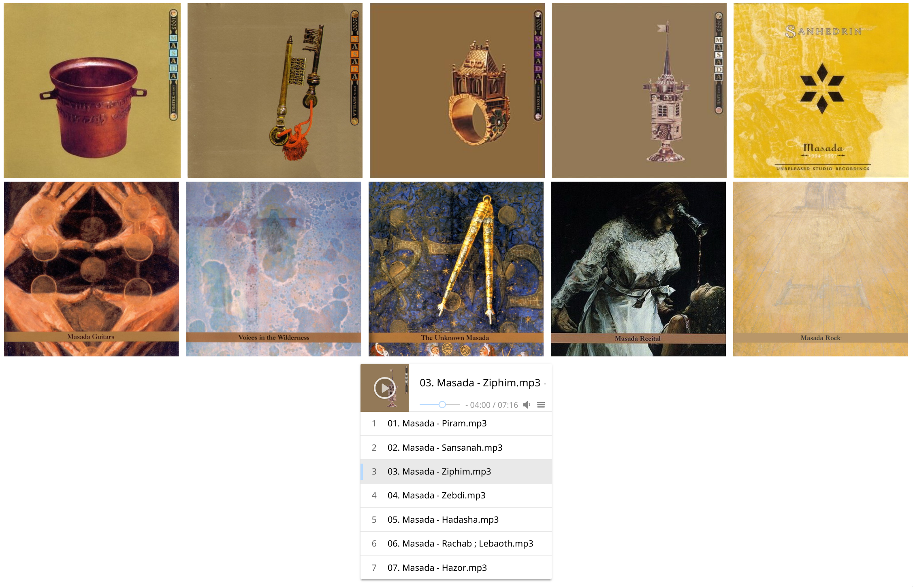

A music player for Upspin

Run it with:

```
$ go run main.go -config /path/to/your/upspin/config
```

And open your browser at http://localhost:8080/listen/a-user@mail.com/path/to/a/folder



It uses [Aplayer music player](https://github.com/MoePlayer/APlayer)
